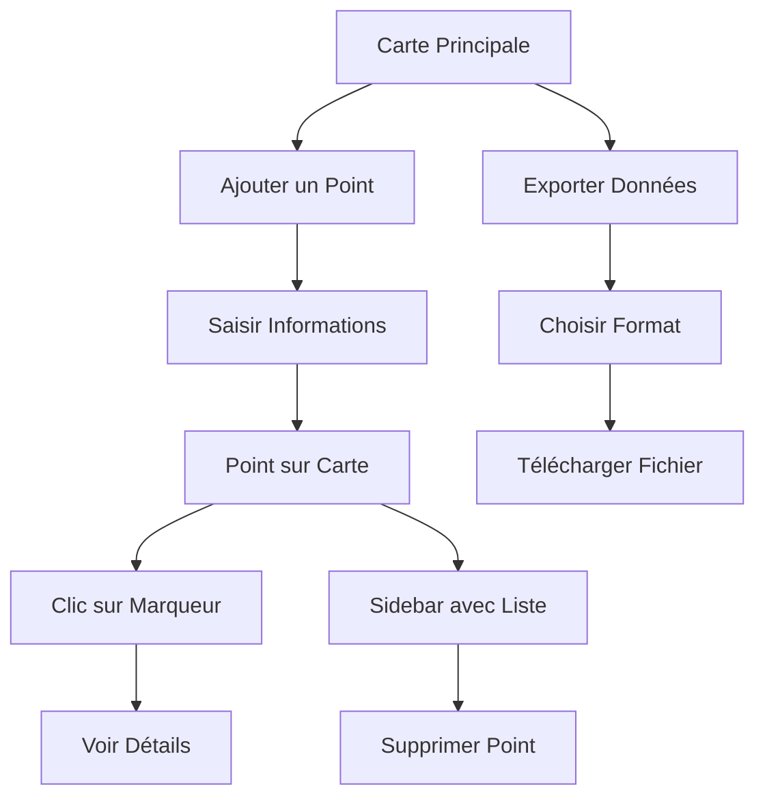

## 1. Product Overview

GeoMark est une application web légère permettant de créer et gérer des points d'intérêt sur une carte OpenStreetMap avec intégration Google Street View. Elle s'adresse aux professionnels et particuliers ayant besoin de cartographier et documenter des lieux précis avec des notes visuelles.

L'application permet de sauvegarder localement les données et d'exporter les points en CSV/JSON pour une utilisation professionnelle.

## 2. Core Features

### 2.1 User Roles
| Role | Registration Method | Core Permissions |
|------|---------------------|------------------|
| Utilisateur | Accès direct sans inscription | Créer, modifier, supprimer des points d'intérêt |

### 2.2 Feature Module

L'application GeoMark comprend les pages suivantes :

1. **Page Carte Principale** : carte interactive OSM, sidebar de gestion, formulaire d'ajout de points
2. **Page Export** : interface d'export des données en CSV/JSON

### 2.3 Page Details

| Page Name | Module Name | Feature description |
|-----------|-------------|---------------------|
| Carte Principale | Carte interactive | Afficher la carte OpenStreetMap avec navigation zoom/dézoom |
| Carte Principale | Marqueurs | Afficher tous les points ajoutés avec leurs coordonnées GPS |
| Carte Principale | Popup marqueur | Afficher titre, notes et lien Street View au clic sur un marqueur |
| Carte Principale | Sidebar gauche | Liste des points avec aperçu Street View et bouton de suppression |
| Carte Principale | Formulaire d'ajout | Saisir titre, notes, coordonnées GPS et URL Street View |
| Carte Principale | Bouton export | Ouvrir l'interface d'export des données |
| Export | Sélection format | Choisir entre export CSV ou JSON |
| Export | Téléchargement | Télécharger le fichier avec tous les points |

## 3. Core Process

### Flux Utilisateur Principal

1. **Découverte** : L'utilisateur arrive sur la carte principale avec la vue d'ensemble
2. **Ajout de point** : Clique sur le formulaire, saisit les informations (titre, notes, coordonnées, URL Street View)
3. **Visualisation** : Le point apparaît sur la carte et dans la sidebar avec preview Street View
4. **Gestion** : L'utilisateur peut cliquer sur les marqueurs pour voir les détails ou supprimer des points
5. **Export** : Accès à l'export des données en CSV ou JSON pour utilisation externe

## 4. User Interface Design

### 4.1 Design Style

- **Couleurs primaires** : Bleu marine (#1e40af) pour les éléments principaux
- **Couleurs secondaires** : Gris clair (#f3f4f6) pour les fonds
- **Style boutons** : Coins arrondis, ombres subtiles au survol
- **Police** : Inter ou system-ui, taille 14-16px pour le texte principal
- **Layout** : Design carte avec sidebar fixe à gauche, carte responsive à droite
- **Icônes** : Heroicons ou Lucide pour une cohérence moderne

### 4.2 Page Design Overview

| Page Name | Module Name | UI Elements |
|-----------|-------------|-------------|
| Carte Principale | Carte | Carte plein écran avec contrôles Leaflet en haut à gauche |
| Carte Principale | Sidebar | Panneau 350px large, fond blanc, scroll vertical si nécessaire |
| Carte Principale | Formulaire | Inputs empilés verticalement, bouton submit bleu primaire |
| Carte Principale | Marqueurs | Pastilles bleues avec icône épingle, popup blanche avec ombre |
| Export | Interface | Carte centrale avec deux boutons larges CSV/JSON |

### 4.3 Responsiveness

- **Desktop-first** : Optimisé pour écrans larges (1200px+)
- **Mobile-adaptatif** : Sidebar devient drawer sur mobile
- **Touch interactions** : Boutons et marqueurs adaptés au touch sur tablette