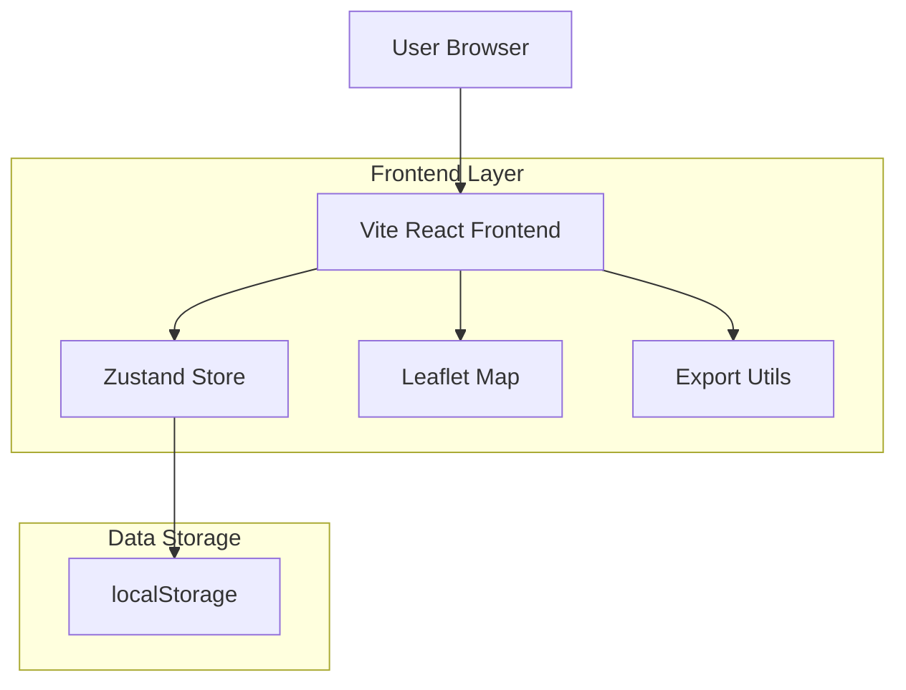
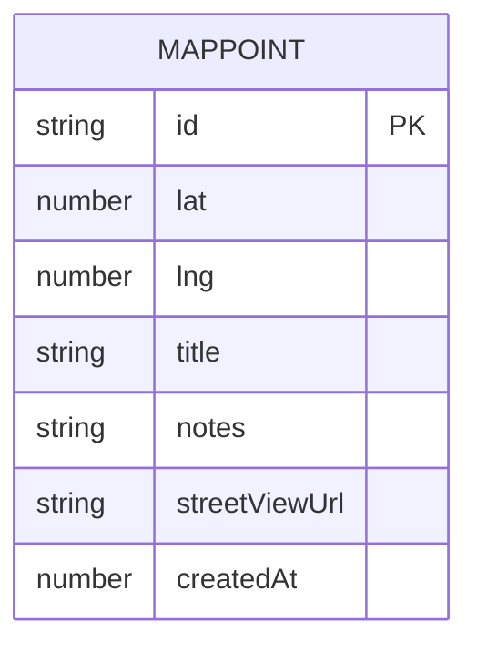

## 1. Architecture design



## 2. Technology Description

* **Frontend**: React\@18 + TypeScript + Vite

* **Initialization Tool**: vite-init

* **State Management**: Zustand\@4

* **Mapping**: Leaflet + react-leaflet

* **Styling**: TailwindCSS + shadcn/ui

* **Export**: parser CSV / JSON + file-saver

* **Backend**: None (application 100% frontend)

## 3. Route definitions

| Route   | Purpose                                     |
| ------- | ------------------------------------------- |
| /       | Carte principale avec sidebar et formulaire |
| /export | Interface d'export des données              |

## 4. API definitions

### 4.1 Core Types

Interface principale MapPoint

```typescript
export interface MapPoint {
  id: string;
  lat: number;
  lng: number;
  title: string;
  notes?: string;
  streetViewUrl?: string;
  createdAt: number;
}
```

### 4.2 Store Methods

```typescript
interface PointsStore {
  points: MapPoint[];
  addPoint: (point: MapPoint) => void;
  removePoint: (id: string) => void;
}
```

### 4.3 Export Functions

```typescript
// Export CSV
export function exportToCSV(points: MapPoint[]): void

// Export JSON  
export function exportToJSON(points: MapPoint[]): void
```

## 5. Server architecture diagram

Pas d'architecture serveur - application 100% frontend avec stockage local.

## 6. Data model

### 6.1 Data model definition



### 6.2 Data Definition Language

Stockage local via localStorage - pas de base de données serveur.

Structure JSON stockée dans localStorage:

```json
[
  {
    "id": "uuid-v4",
    "lat": 47.0,
    "lng": -0.8,
    "title": "Point d'intérêt",
    "notes": "Description détaillée",
    "streetViewUrl": "https://maps.google.com/...",
    "createdAt": 1700000000000
  }
]
```

### 6.3 Composants principaux

**MapView\.tsx**

* Carte Leaflet avec tuiles OSM

* Affichage des marqueurs

* Gestion des popups

**Sidebar.tsx**

* Liste des points

* Formulaire d'ajout

* Preview Street View

**MarkerPopup.tsx**

* Contenu des popups

* Lien vers Street View

**StreetViewFrame.tsx**

* Iframe d'aperçu Street View

* Gestion du chargement

